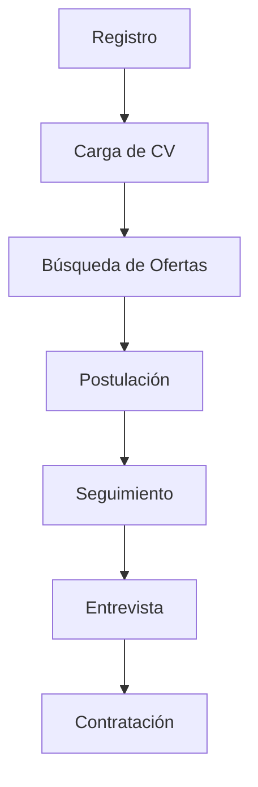

# 🧪 Testing QA - Talento Lab

## 📋 Descripción del Proyecto

Proyecto final de Testing QA realizado sobre la plataforma **Talento Lab**, una aplicación web y móvil de búsqueda de empleo que conecta talentos con oportunidades laborales.

**Plataforma:** Talento Lab (web & mobile)  
**URL de Testing:** https://talentolab-test.netlify.app  
**Alumno:** Pablo Joaquín Corazza  
**Fecha de Entrega:** 19/07/2025

## 🎯 Objetivos del Proyecto

- Validar funcionalidades críticas de la plataforma
- Asegurar experiencia de usuario consistente en múltiples dispositivos
- Implementar proceso completo de gestión de defectos
- Generar métricas de cobertura y calidad

## 📊 Documentación Completa

📄 **[Ver Documentación en Google Sheets](QA: Modelo entrega)**

## 🏗️ Arquitectura de Testing

### Alcance de Pruebas
- ✅ **Servicios** - Validación de funcionalidades principales
- ✅ **Nuestros Clientes** - Carrusel y elementos interactivos
- ✅ **Contacto** - Formularios y validaciones
- ✅ **Registro** - Creación de cuentas y carga de CV

### Estrategia de Testing

#### 🔧 Funcional (Manual)
- Test Cases positivos y negativos
- Validación de criterios de aceptación
- Flujos de usuario end-to-end

#### 🔍 Exploratorio
- Sesiones ad-hoc para casos especiales
- Validación de archivos inválidos
- Comportamientos límite

#### ⚡ No Funcional
- **Rendimiento:** Tiempos < 2s con Lighthouse
- **Compatibilidad:** Chrome, Firefox, Safari
- **Accesibilidad:** Contraste 4.5:1, etiquetas alt

#### 📱 Responsividad
- **Desktop:** 1920×1080
- **Tablet:** 768×1024  
- **Móvil:** 390×844

## 🚀 User Stories Implementadas

### Épica: Registro y Perfil
```gherkin
Como visitante, quiero registrarme para crear mi cuenta
DADO que estoy en la página de registro
CUANDO completo los campos requeridos
ENTONCES recibo confirmación por email
```

### Épica: Búsqueda y Postulación
```gherkin
Como usuario, quiero buscar ofertas por palabra clave
DADO que estoy en la página de búsqueda
CUANDO ingreso términos de búsqueda
ENTONCES veo resultados relevantes paginados
```

## 🛠️ Herramientas Utilizadas

| Herramienta | Propósito |
|-------------|-----------|
| **Jira** | Gestión de tickets y defectos |
| **Zephyr** | Ejecución de test cycles |
| **Lighthouse** | Análisis de rendimiento |
| **DevTools** | Debugging y análisis técnico |
| **Google Sheets** | Documentación y reportes |

## 📈 Métricas de Cobertura

| Funcionalidad | TC Ejecutados | Cobertura | Prioridad |
|---------------|:-------------:|:---------:|:---------:|
| Registro de usuarios | 4/5 | 80% | Alta |
| Carga de CV | 2/4 | 50% | Alta |
| Navegación del sitio | 3/3 | 100% | Media |
| Validaciones de formulario | 5/6 | 83% | Alta |
| Accesibilidad | 2/5 | 40% | Media |
| Gestión de errores | 3/3 | 100% | Baja |

## 🐛 Gestión de Defectos

### Proceso de Bug Lifecycle
1. **Detección** → Identificación durante ejecución
2. **Registro** → Creación de ticket en Jira
3. **Asignación** → Assignment por Scrum Master
4. **Corrección** → Development y Code Review
5. **Verificación** → Re-testing por QA
6. **Cierre** → Validación final

### Ejemplos de Defectos Encontrados
- **BUG-001:** Menú hamburguesa con bajo contraste en móvil
- **BUG-002:** Selector de CV se superpone al footer en tablet
- **BUG-003:** Carrusel no responde a gestos swipe en móvil
- **BUG-004:** Campo email oculto tras abrir teclado móvil

## 📅 Sprint Planning

### Sprint de 1 Semana - 4 User Stories

**Día 1:** Configuración de entornos y datos de prueba  
**Día 2-3:** Ejecución de Test Cases funcionales  
**Día 4:** Pruebas no funcionales y exploratorias  
**Día 5:** Testing móvil y consolidación de reportes

## 🎭 User Persona - Storytelling

**Lucía, Ilustradora, 30 años**

> *"Después de perder mi trabajo, Talento Lab no solo me devolvió la oportunidad de trabajar, sino algo aún más importante: la confianza en mí misma."*

Lucía representa a nuestro usuario objetivo: profesionales creativos que buscan oportunidades alineadas con sus habilidades, necesitando una plataforma intuitiva y eficiente.

## 🔄 Flujo de Trabajo



## 📋 Criterios de Aceptación

### Funcionales
- ✅ Formulario de registro completo
- ✅ Carga de archivos PDF/DOCX < 5MB
- ✅ Búsqueda con filtros funcional
- ✅ Postulación con confirmación

### No Funcionales
- ✅ Tiempo de respuesta < 2s
- ✅ Compatible con navegadores principales
- ✅ Responsive en todos los dispositivos
- ✅ Accesibilidad básica implementada

## 🚀 Mejoras Propuestas

1. **Incrementar cobertura** de Carga de CV y Accesibilidad al 80%+
2. **Reducir tasa de fallos** en validaciones de formulario
3. **Priorizar defectos** de severidad alta en módulos críticos
4. **Diseñar test cases adicionales** para escenarios límite
5. **Implementar buffers de tiempo** del 10% para pruebas exploratorias

## 📁 Estructura del Proyecto

```
proyecto-qa-talento-lab/
├── documentacion/
│   ├── plan-de-pruebas.md
│   ├── casos-de-prueba.xlsx
│   └── user-stories.md
├── evidencias/
│   ├── screenshots/
│   ├── bug-reports/
│   └── metricas/
├── jira-exports/
│   ├── backlog.png
│   ├── sprint-report.png
│   └── cumulative-flow.png
└── README.md
```

## 📞 Contacto

**Pablo Joaquín Corazza**  
Proyecto Final - Testing QA  
Plataforma: Talento Lab

---

*Desarrollado con dedicación para demostrar competencias en Testing QA, gestión de defectos y aseguramiento de la calidad de software.*
